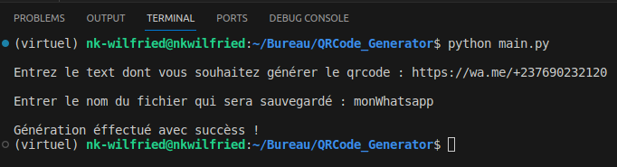

# Générateur de QR CODE

Afin que ce programme fonctionne, vous devez premièrement installer les dependances en tapant la commande:
```pip install -r requirements.txt```

Une fois les dependances installées, vous pouvez lancer le programme.

EXEMPLE : je souhaite générer une image qrcode qui mène vers mon whatsapp

- Application du programme:



- Fichier Généré : 


- Contenu du fichier << monWhatsapp.png >>

